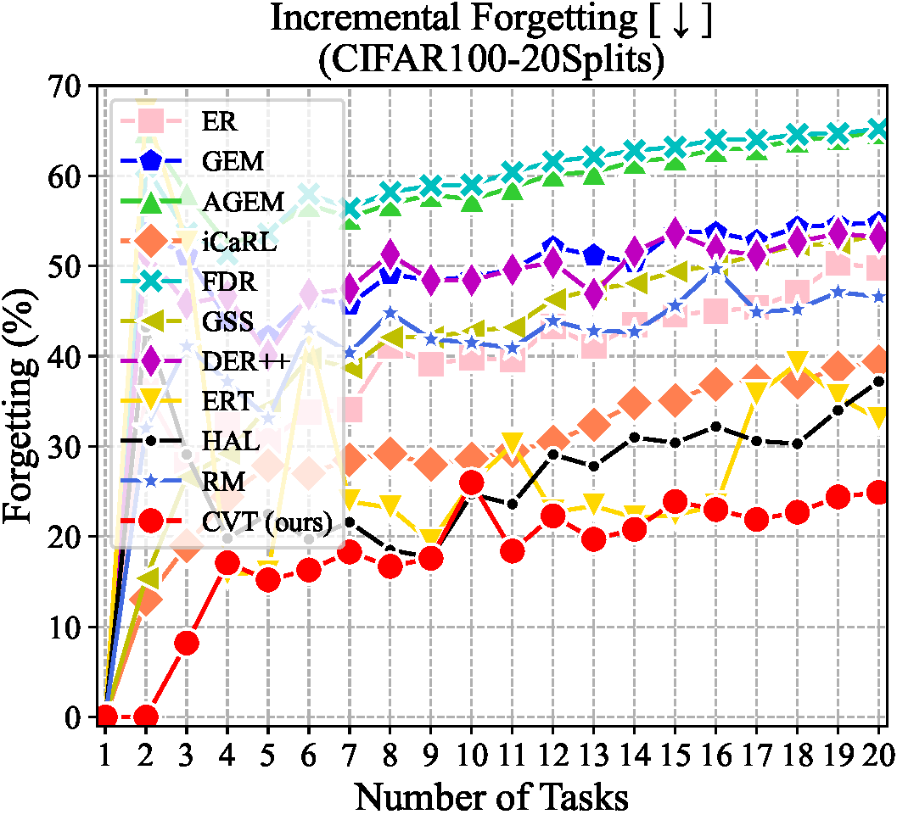
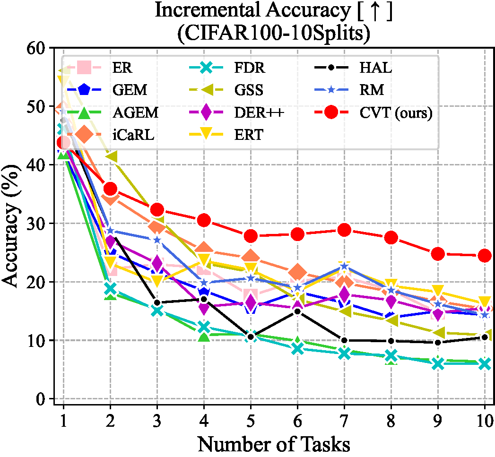

# Online Continual Learning with Contrastive Vision Transformer (CVT)


## 📋Dependence

See [requirements.txt](./requirements.txt)

## 📋Running

- Use ./utils/main.py to run experiments. 

- New models can be added to the models/ folder.

- New datasets can be added to the dataset/ folder.

## 📋Results

We demonstrate the average incremental performance under the Task-free protocol with 500 memory buffer, which is the result of evaluating on all the tasks observed so far after completing each task. The results are curves of accuracy and forgetting after each task. It is observed that the performance of most methods degrades rapidly as new tasks arrive, while our method consistently outperforms the state-of-the-art methods in both accuracy and forgetting throughout the learning.


<table>
    <tr>
        <td ><center></center></td>
        <td ><center></center></td>
    </tr>
<table>

<!-- 


 -->

## 📋Conclusion

In this paper, we propose a novel attention-based framework, Contrastive Vision Transformer (CVT), to effectively mitigate the catastrophic forgetting for online CL. To the best of our knowledge, this paper is the first in the literature to design a Transformer for online CL. CVT contains external attention and learnable focuses to accumulate previous knowledge and maintain class-specific information. With a proposed focal contrastive loss in training, CVT rebalances contrastive continual learning between new and past classes and improves the inter-class distinction and intra-class aggregation. Moreover, CVT designs a dual-classifier structure to decouple learning current classes and balancing all seen classes. Extensive experimental results show that our approach significantly outperforms current state-of-the-art methods with fewer parameters. Ablation analyses validate the effectiveness of the proposed components. 


If our work is helpful to you, please kindly cite our papers as:

```
@article{arxiv_contrastive,
	author = {Wang, Zhen and Liu, Liu and Kong, Yajing and Guo, Jiaxian and Tao, Dacheng},
	journal = {arXiv preprint arXiv:2207.13516},
	title = {Online Continual Learning with Contrastive Vision Transformer},
	year = {2022}}
  
@inproceedings{ECCV22_CL,
	author = {Wang, Zhen and Liu, Liu and Kong, Yajing and Guo, Jiaxian and Tao, Dacheng},
	booktitle = {ECCV},
	title = {Online Continual Learning with Contrastive Vision Transformer},
	year = {2022}}

@inproceedings{CVPR22_LVT,
	author = {Wang, Zhen and Liu, Liu and Duan, Yiqun and Kong, Yajing and Tao, Dacheng},
	booktitle = {Proceedings of the IEEE/CVF Conference on Computer Vision and Pattern Recognition (CVPR)},
	month = {June},
	pages = {171-181},
	title = {Continual Learning With Lifelong Vision Transformer},
	year = {2022}}
```


All rights reserved.

